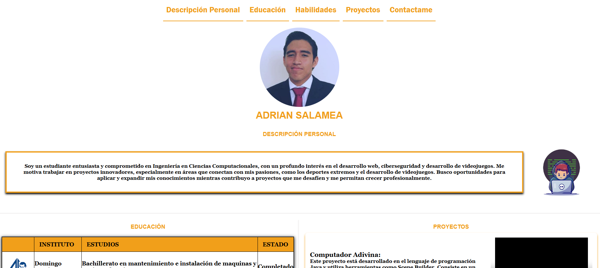
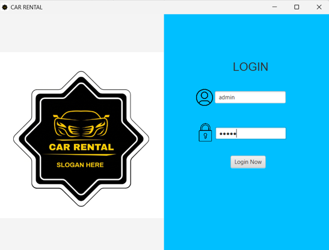

# 👋 Adrian Lautaro Salamea Quimis
## 💎 Contenido
* [Acerca de mí](#-acerca-de-mí)
* [Proyectos](#-proyectos)
* [Estadísticas de GitHub](#-estadísticas-de-github)
* [Tecnologías y herramientas](#-tecnologías-y-herramientas)
* [Contactos](#-contactos)

## 🧑‍💼 Acerca de mí
Soy Adrián Salamea, un entusiasta estudiante de Ingeniería en Ciencias Computacionales en la universidad ESPOL, Ecuador. Me apasionan áreas como el desarrollo de videojuegos, ciberseguridad, desarrollo web y aplicaciones móviles. Mi objetivo es continuar aprendiendo y desarrollándome profesionalmente, siempre buscando nuevos retos que me permitan crecer. Al finalizar mis estudios, aspiro a formar parte de un proyecto de desarrollo de videojuegos, ya sea para consolas o PC, y contribuir con mis conocimientos y creatividad al avance de la industria.
## ✅ Proyectos
* Juegos de adivinanzas con preguntas a la computadora:Este proyecto está desarrollado en el lenguaje de programación Java y utiliza herramientas como Scene Builder. Consiste en un juego en el que la computadora adivina el animal en el que estás pensando mediante una serie de preguntas.

  
   
  <a href="https://github.com/gTeran12/ProyectoArboles.git" target="_blank">
    <button style="padding: 10px 20px; background-color: #007bff; color: white; border: none; border-radius: 5px; cursor: pointer;">
        Ir al Repositorio del proyecto
    </button>
</a>

* El proyecto consiste en crear un CV digital utilizando HTML y CSS para estructurar y estilizar la información. Incluye secciones como datos personales, experiencia laboral, educación, habilidades y contacto. El diseño será profesional, responsivo y adaptable a diferentes dispositivos, demostrando conocimientos básicos y avanzados en desarrollo web.

  
   
  <a href="https://github.com/gTeran12/ProyectoArboles.git" target="_blank">
    <button style="padding: 10px 20px; background-color: #007bff; color: white; border: none; border-radius: 5px; cursor: pointer;">
        Ir al Repositorio del proyecto
    </button>
</a>

* El proyecto es una aplicación de gestión de vehículos usados desarrollada en JavaFX, usando estructuras de datos personalizadas y persistencia con archivos. Permite crear, editar, eliminar, filtrar y ordenar vehículos, con opciones avanzadas como comparación y filtros adicionales, ofreciendo una interfaz eficiente y visualmente atractiva.

  
   
  <a href="https://github.com/gTeran12/ProyectoArboles.git" target="_blank">
    <button style="padding: 10px 20px; background-color: #007bff; color: white; border: none; border-radius: 5px; cursor: pointer;">
        Ir al Repositorio del proyecto
    </button>
</a>

## 📈 Estadísticas de GitHub

  

## 🧑‍💻 Tecnologías y herramientas

## 📒 Contactos y redes

