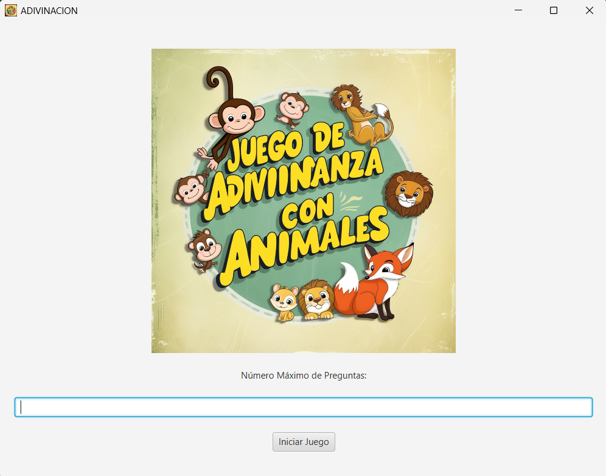

# 👋Adrian Lautaro Salamea Quimis
## 💎 Contenido
* [Sobre mí](#-acerca-de-mí)
* [Proyectos](#-proyectos)
* [Estadísticas de GitHub](#-estadísticas-de-github)
* [Tecnologías y herramientas](#-tecnologías-y-herramientas)

## 🧑‍💼 Acerca de mí
Soy Adrián Salamea, un entusiasta estudiante de Ingeniería en Ciencias Computacionales en la universidad ESPOL, Ecuador. Me apasionan áreas como el desarrollo de videojuegos, ciberseguridad, desarrollo web y aplicaciones móviles. Mi objetivo es continuar aprendiendo y desarrollándome profesionalmente, siempre buscando nuevos retos que me permitan crecer. Al finalizar mis estudios, aspiro a formar parte de un proyecto de desarrollo de videojuegos, ya sea para consolas o PC, y contribuir con mis conocimientos y creatividad al avance de la industria.
## ✅ Proyectos
* Juegos de adivinanzas con preguntas

  

## 📈 Estadísticas de GitHub

## 🧑‍💻Tecnologías y herramientas

